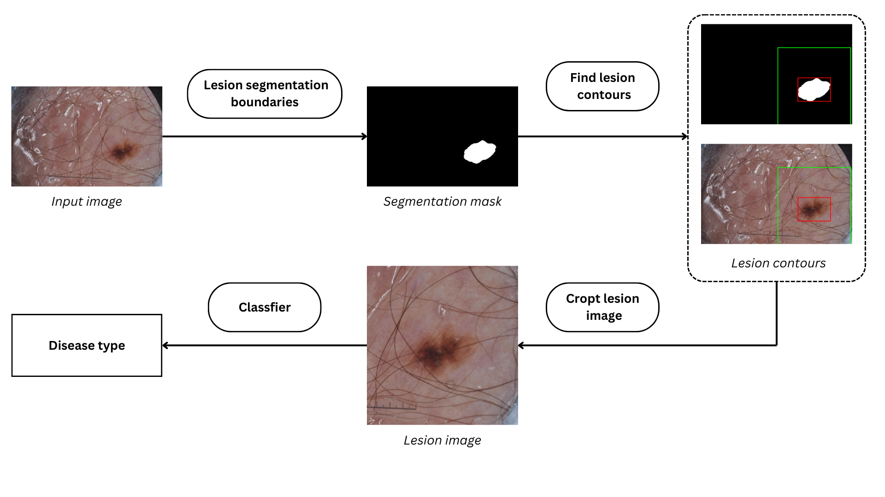
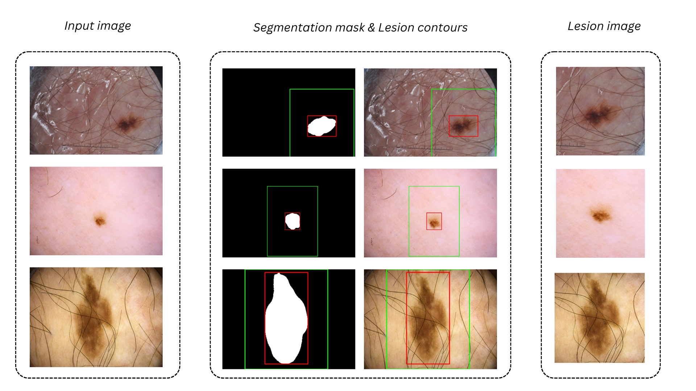
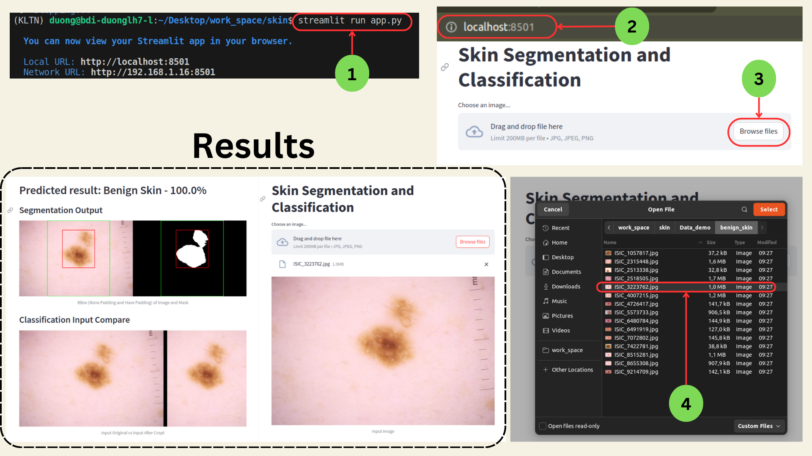
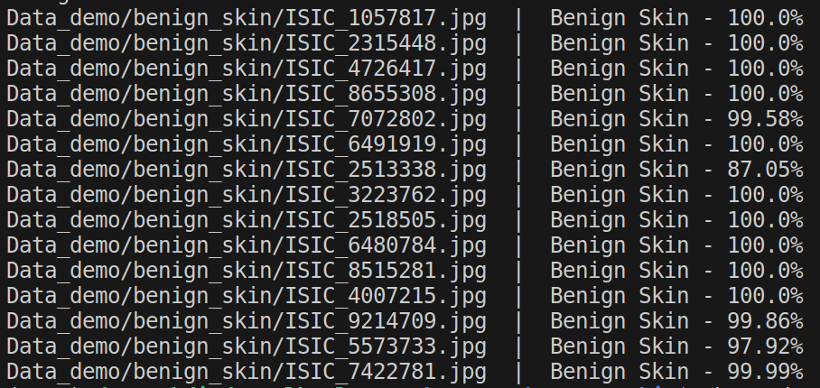
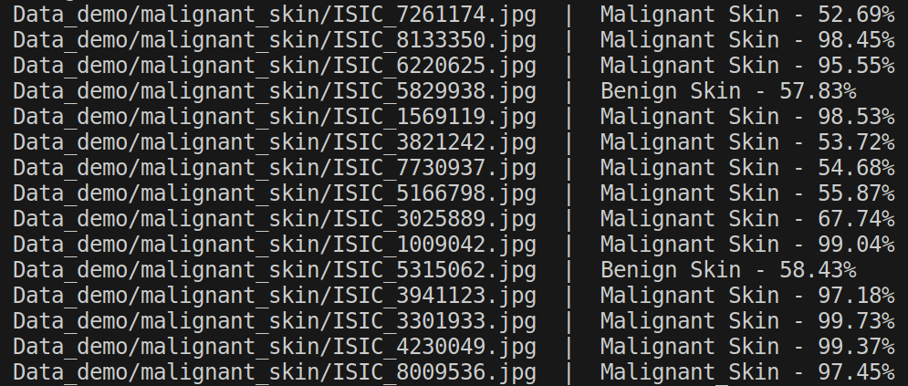

# README

## 0. Method

The proposed method follows a pipeline approach. The visual representation of the pipeline is shown below:

Here are some examples illustrating the method:

## 1. Running the Demo Code

To run the demo code, follow these steps:

- Install Python 3.8.18
- Install dependencies using `pip install -r requirements.txt`
- Run the command `streamlit run app.py`
  - Access the following URLs:
    - Local URL: [http://localhost:8501](http://localhost:8501/)
    - Network URL: [http://192.168.1.16:8501](http://192.168.1.16:8501/)
- Upload an image and wait for the results

Benign Skin Demo Dataset Results:

Malignant Skin Demo Results:

## 2. Running the Segmentation Model Training Code

To run the code for training the segmentation model:

- Navigate to the 'Training_Segformers' folder
- Run the entire 'ISIC2020_Training_Segformers.ipynb' notebook
  - Make sure to download the ISIC 2018 dataset (link: https://challenge.isic-archive.com/data/#2018)
  - The code is pre-configured to run on Google Colab
  - Evaluate the results at the end of the notebook

## 3. Running the Classification Model Training Code

To run the code for training the classification model:

- Navigate to the 'Training_ConvNeXt' folder
- Download the ISIC 2020 dataset (link: https://challenge.isic-archive.com/data/#2020)
- Split the dataset by running 'ISIC2020_data_split.ipynb'
- Crop images by running 'ISIC_2020_segment_cropt.ipynb'
- Augment data by running 'ISIC_2020_augment.ipynb'
- Train and evaluate the model by running 'Training_ConvNeXt/ISIC2020_Training_ConvNeXt.ipynb'